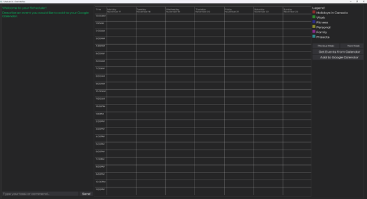
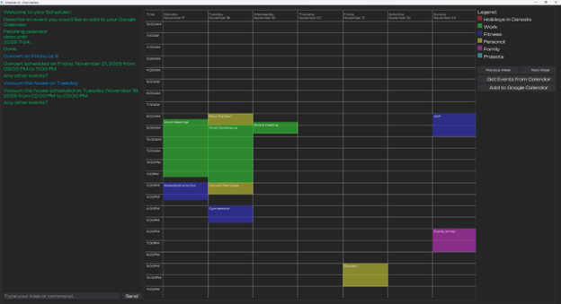

# AI Scheduler (Desktop Version)

##  Overview
AI Scheduler is a Python-based weekly scheduling application built with Dear PyGui.  
It automates event management by reducing manual rescheduling, provides a clean calendar grid, and supports intelligent deduplication of tasks.

Currently, this version runs as a desktop app. A future roadmap includes migrating to a Django web app with user accounts and online deployment.

---

##  Features
- Add, edit, and delete events
- Automatic rescheduling of non‑timed tasks
- Weekly calendar grid with visual event blocks
- Deduplication logic for reliable event handling
- Customizable colors and layout

---

##  Tech Stack
- **Language:** Python 3.10
- **Libraries:** Dear PyGui, datetime
- **Concepts:** Event‑driven programming, OOP, UI/UX layout troubleshooting

---

##  Project Structure
- **main.py** - Main file. Initializes connection to the users Google Calendar and calls the interface.
- **interface.py** - Handles all interface operations.
- **event.py** - Contains the Event class
- **calendar_class**.py - Contains the Calendar class, and all operations such as reading, adding and removing events.
- **interpreter.py** - Interprets user inputs to determine all important information. Also aids in reading events from the Google Calendar to determine their event type.
- **events.json** - A .json file that contains all events being displayed in the interface calendar


#  Getting Started

### Prerequisites
- Python 3.10+
- Install dependencies: 
  ```bash
  pip install -r requirements.txt
  ```
##  Google API Setup

This project integrates with Google Calendar using OAuth 2.0.  
To run the app, you’ll need to create your own `credentials.json` file from Google Cloud Console.


### Steps
1. Go to [Google Cloud Console](https://console.cloud.google.com/).
2. Create a new project (or select an existing one).
3. Enable the **Google Calendar API**.
4. In the left sidebar, go to **APIs & Services > Credentials**.
5. Click **Create Credentials > OAuth client ID**.
6. Choose **Desktop app** as the application type.
7. Download the JSON file and rename it to `credentials.json`.
8. Place `credentials.json` in the root folder of this project.

##  OpenAI API Setup
This project uses the OpenAI API. To run it, you need your own API Key.
### Steps
1. Sign up or log in at [OpenAI](https://platform.openai.com/docs/overview).
2. Go to API Keys in your account and create a free new key.
3. Create a file named `.env` in the root folder of this project (AI-Scheduler)
4. Add the following line to your `.env` folder (replace `your_api_key_here` with your key.)
```
OPENAI_API_KEY=your_api_key_here
```
5. The project will automatically load your key when you run it.
## Running the App
1. **Clone or download the project**
```
git clone https://github.com/Arowe14/AI-Scheduler
cd ai-scheduler
```
2. **Install required packages**\
```
pip install -r requirements.txt
```
3. **Run the project**
```
python main.py
```
### First Run
- On the first run, the app will open a browser window asking you to log in with your Google account.
- After granting access, a `token.json` file will be created automatically in the project folder.
- On subsequent runs, the app will use `token.json` so you don’t need to log in again.

---

# Usage
1. **Describe events in the chat window**
- Events will automatically be parsed to determine key details and place them correctly in the calendar.
- Events will be coloured based on the calendar that seems the most appropriate based on the description.
2. **Fetch current events inside your Google Calendar using the *Get events from Calendar* button** 
- Events from your Google Calendar for the selected week will be placed onto the interface calendar. 
3. **Navigate between weeks using the *Previous Week* and *Next Week* buttons**
- Previously placed and fetched events from these weeks will remain present when switching to another week.
4. **Add new and changed events directly to your Google Calendar using the *Add to Google Calendar* button**
- Events will be added directly to your calendar with all relevant information that was provided.
- Only new events will be added as to not add existing events to the calendar again.
### Screenshots






## Known Limitations
- Desktop-only (Dear PyGui)
- No user accounts. Only local storage.
- No recurring events, or full-day/multi-day event support

## Roadmap
- Migrate UI to Django web app
- Add user authentication
- Deploy online for multi-user access
- Improve responsive layout
---
### Important
Do not upload your credentials.json or token.json to GitHub. These files contain sensitive information and should be kept private.